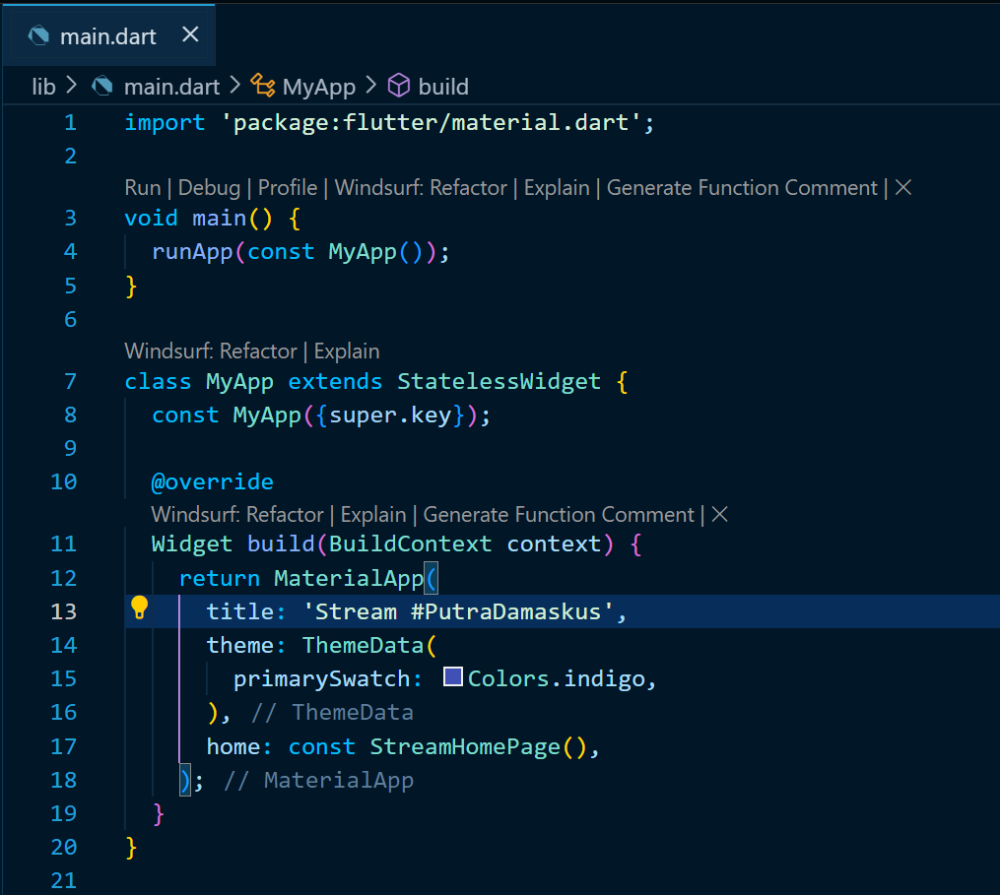
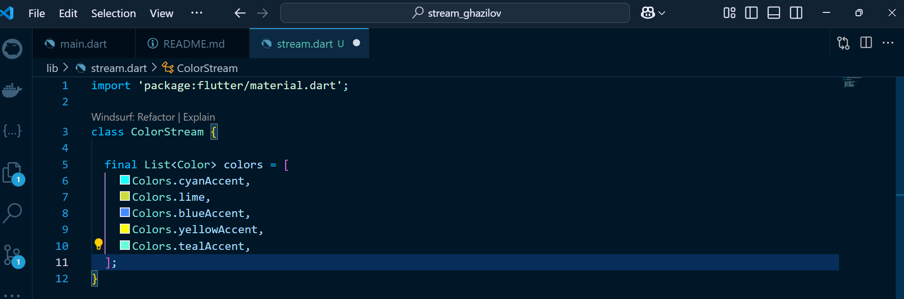
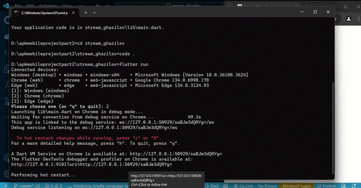
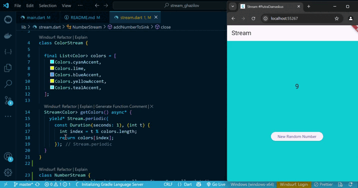
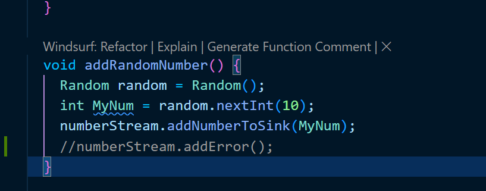
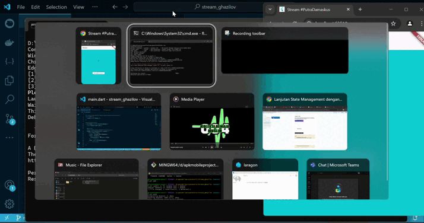
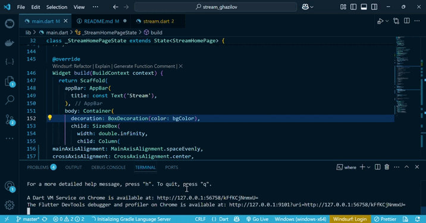

# stream_ghazilov
Projek Flutter Baru (PojokSoal)

## SOAL 1 PRAKTIKUM 1: DART STREAMS

- Tambahkan nama panggilan Anda pada title app sebagai identitas hasil pekerjaan Anda.
- Gantilah warna tema aplikasi sesuai kesukaan Anda.
- Lakukan commit hasil jawaban Soal 1 dengan pesan "P1: Jawaban Soal 1"

JAWABAN

1. Untuk nama panggilan sudah dirubah dan ditambahkan pada bagian title sebagai identitas projek yang saat ini dikerjakan


2. Commit Done

## SOAL 2 PRAKTIKUM 1: DART STREAMS

- Tambahkan 5 warna lainnya sesuai keinginan Anda pada variabel colors tersebut
- Lakukan commit hasil jawaban Soal 2 dengan pesan "P1: Jawaban Soal 2"

JAWABAN

1. Saya telah menambahkan beberapa warna yang berbeda didalam setiap entity, berikut saya sertakan hasil screenshotnya 


2. Commit Done

## SOAL 3 PRAKTIKUM 1: DART STREAMS

- Jelaskan fungsi keyword yield* pada kode tersebut!
- Apa maksud isi perintah kode tersebut?
- Lakukan commit hasil jawaban Soal 3 dengan pesan "P1: Jawaban Soal 3"

JAWABAN

1. Keyword yield* digunakan untuk menyebarkan atau meneruskan seluruh nilai dari stream lain ke dalam stream saat ini. Dalam kode tersebut, yield* meneruskan semua nilai dari Stream.periodic, yang menghasilkan nilai baru setiap satu detik. Setiap nilai yang dihasilkan adalah warna dari daftar colors, dengan indeks yang berubah-ubah mengikuti waktu (t). Jadi, fungsi getColors() akan terus mengeluarkan warna secara bergantian setiap detik dari daftar colors melalui stream.

2. Commit Done

## SOAL 4 PRAKTIKUM 1: DART STREAMS

- Capture hasil praktikum Anda berupa GIF dan lampirkan di README.
- Lakukan commit hasil jawaban Soal 4 dengan pesan "P1: Jawaban Soal 4

JAWABAN

1. Hasil Screen capture


2. Commit Done

## SOAL 5 PRAKTIKUM 1: DART STREAMS

- Jelaskan perbedaan menggunakan listen dan await for (langkah 9) !
- Lakukan commit hasil jawaban Soal 5 dengan pesan "P1: Jawaban Soal 5"

JAWABAN

1. Perbedaan antara listen dan await for dalam konteks Stream terletak pada cara keduanya mengakses dan mengelola data stream:
- await for hanya bisa digunakan dalam fungsi async dan menunggu setiap data dari stream secara berurutan dan sinkron. Artinya, proses akan berhenti sementara sampai data baru diterima dari stream berikutnya. Cocok digunakan jika kamu ingin menunggu satu per satu data secara teratur atau menghentikan stream di tengah jalan menggunakan break.
- Sedangkan listen akan langsung berlangganan ke stream dan mendengarkan semua data yang masuk secara asinkron tanpa menghentikan eksekusi kode lainnya. listen juga memberikan lebih banyak fleksibilitas karena mendukung parameter tambahan seperti onDone, onError, dan cancelOnError.

2. Commit Done

## SOAL 6 PRAKTIKUM 2: STREAM CONTROLLERS & SINKS

- Jelaskan maksud kode langkah 8 dan 10 tersebut!
- Capture hasil praktikum Anda berupa GIF dan lampirkan di README.
- Lalu lakukan commit dengan pesan "P2: Jawaban Soal 6".

JAWABAN

1. Langkah 8-initState()

```kotlin
@override
void initState() {
  numberStream = NumberStream();
  numberStreamController = numberStream.controller;
  Stream stream = numberStreamController.stream;
  stream.listen((event) {
    setState(() {
      lastNumber = event;
    });
  });
  super.initState();
}
```
 Penjelasan:

- Fungsi initState() dijalankan sekali saat pertama kali StatefulWidget dibangun.
- numberStream = NumberStream();
➤ Membuat objek dari kelas NumberStream yang berisi StreamController.

- numberStreamController = numberStream.controller;
➤ Mengakses controller dari objek NumberStream dan menyimpannya ke dalam variabel.

- Stream stream = numberStreamController.stream;
➤ Mengambil stream dari controller untuk didengarkan perubahannya.

- stream.listen(...)
➤ Mendengarkan data yang masuk ke stream, dan setiap ada data baru (event), maka:
    - Fungsi setState dipanggil untuk memperbarui nilai lastNumber di UI.
    - UI akan langsung merespons perubahan tersebut.

langkah 10-addRandomNumber()
```kotlin
  void addRandomNumber() {
  Random random = Random();
  int MyNum = random.nextInt(10);
  numberStream.addNumberToSink(MyNum);
}
```
Penjelasan:
- Fungsi ini digunakan untuk menghasilkan angka acak dari 0 sampai 9.
- Random random = Random();
➤ Membuat objek acak.

- int MyNum = random.nextInt(10);
➤ Menghasilkan angka acak antara 0 sampai 9.

- numberStream.addNumberToSink(MyNum);
➤ Mengirim angka tersebut ke stream menggunakan method addNumberToSink() (yang seharusnya sudah didefinisikan di dalam kelas NumberStream). ➤ Setelah angka terkirim ke stream, fungsi listen di langkah 8 akan menangkapnya dan memperbarui tampilan UI.

Hubungan Langkah 8 dan 10:
- Langkah 8 menyambungkan stream dengan UI agar bisa menampilkan data baru.
- Langkah 10 mengirim data baru (angka acak) ke stream.
- Ketika data dikirim melalui langkah 10, maka UI otomatis merespons karena sudah "mendengarkan" dari langkah 8

2. Hasil Screen capture


3. Commit Done

## SOAL 7 PRAKTIKUM 2 :STREAM CONTROLLERS & SINKS

- Jelaskan maksud kode langkah 13 sampai 15 tersebut!
- Kembalikan kode seperti semula pada Langkah 15, comment addError() agar Anda dapat melanjutkan ke praktikum 3 berikutnya.
- Lalu lakukan commit dengan pesan "P2: Jawaban Soal 7".

JAWABAN

1. Langkah 13-addError()
```kotlin
addError() {
  controller.sink.addError('error');
}
```
Penjelasan
- Fungsi addError() digunakan untuk mengirim error ke dalam stream.
- controller.sink.addError('error'); akan memicu stream menghasilkan error dengan pesan 'error'.
- Ini akan ditangkap oleh listener yang mendengarkan error di langkah 14

Langkah 14-Menangani Error di listener
```kotlin
}).onError((error){
  setState(() {
    lastNumber = -1;
  });
});
```
Penjelasan
- Bagian ini adalah penanganan error (onError) pada stream listener.
- Ketika ada error yang masuk (dari addError() tadi), maka blok ini akan dijalankan.
- Di dalam setState, lastNumber diubah menjadi -1 sebagai indikator bahwa terjadi error.
- UI kemudian akan menampilkan angka -1 sebagai tanda ada kesalahan (misalnya ketika pengguna menekan tombol error).

Langkah 15-Memodifikasi addRandomNumber() untuk Uji Error
```kotlin
void addRandomNumber() {
  Random random = Random();
  //int MyNum = random.nextInt(10);
  //numberStream.addNumberToSink(MyNum);
  numberStream.addError();
}
```
Penjelasan
- Di langkah ini, fungsi addRandomNumber() tidak lagi menghasilkan angka acak.
- Sebagai gantinya, ia mengirim error ke stream dengan memanggil numberStream.addError().
- Ini akan langsung memicu bagian onError di langkah 14 dan membuat lastNumber menjadi -1

Kesimpulan
Langkah 13 hingga 15 digunakan untuk mengimplementasikan dan menguji penanganan error pada stream. Error dikirim menggunakan addError(), lalu ditangani melalui listener onError(), dan hasilnya akan ditampilkan dengan mengubah nilai lastNumber menjadi -1 sebagai indikator bahwa error telah terjadi. Ini penting agar aplikasi tetap stabil meskipun terjadi kesalahan dalam aliran data.

2. 

commit done


## SOAL 8 PRAKTIKUM 3:INJEKSI DATA KE STREAMS

- Jelaskan maksud kode langkah 1-3 tersebut!
- Capture hasil praktikum Anda berupa GIF dan lampirkan di README.
- Lalu lakukan commit dengan pesan "P3: Jawaban Soal 8".

JAWABAN

1. Langkah 1
```kotlin
late StreamTransformer transformer;
```
- Menyatakan bahwa kita akan menggunakan StreamTransformer namun akan menginisialisasikannya nanti.
Tipe datanya belum ditentukan secara eksplisit, tapi nanti akan diisi dengan StreamTransformer<int, int>.

Langkah 2
```kotlin
transformer = StreamTransformer<int, int>.fromHandlers(
  handleData: (value, sink) {
    sink.add(value * 10);
  },
  handleError: (error, trace, sink){
    sink.add(-1);
  },
  handleDone: (sink) => sink.close()
);
```
Di sini kita membuat transformer yang berfungsi untuk memanipulasi data dari stream:
- handleData: jika data masuk (misalnya angka 2), maka akan dikalikan 10 → hasil: 20.
- handleError: jika ada error, maka akan mengembalikan nilai -1.
- handleDone: jika stream selesai, maka akan menutup sink.

Langkah 3
```kotlin
stream.transform(transformer).listen((event){
  setState(() {
    lastNumber = event;
  });
}).onError((error) {
  setState(() {
    lastNumber = -1;
  });
});
super.initState();
```
Di sini, stream (aliran data) di-transform dengan transformer yang telah dibuat:
- Setiap data yang diterima dari stream akan diproses oleh transformer.
- Jika tidak error, hasil akhirnya (yang sudah dikalikan 10) akan ditampilkan di UI (lastNumber).
- Jika ada error, maka lastNumber akan diset menjadi -1.

Kesimpulan:
Langkah 1–3 digunakan untuk memproses dan memanipulasi data stream sebelum ditampilkan ke layar. Data asli yang masuk ke stream akan dikalikan 10 terlebih dahulu melalui transformer, dan jika terjadi error, nilai default -1 akan ditampilkan. Ini menunjukkan pemanfaatan StreamTransformer untuk filtering dan manipulasi data di Flutter secara reaktif.

2. Hasil Screen capture


3. commit done

## SOAL 9 PRAKTIKUM 4: SUBSCRIBE KE STREAM EVENTS

- Jelaskan maksud kode langkah 2, 6 dan 8 tersebut!
- Capture hasil praktikum Anda berupa GIF dan lampirkan di README.
- Lalu lakukan commit dengan pesan "P4: Jawaban Soal 9".

JAWABAN

1. Penjelasan dari ketiga langkah tersebut—Langkah 2, 6, dan 8—berkaitan erat dengan penggunaan stream, controller, subscription, dan data flow dari stream di Flutter.

Langkah 2: Menginisialisasi Stream dan Subscription
```kotlin
@override
void initState() {
  super.initState();

  numberStream = NumberStream();
  numberStreamController = numberStream.controller;

  Stream stream = numberStreamController.stream;
  subscription = stream.listen((event) {
    setState(() {
      lastNumber = event;
    });
  });
}
```

Penjelasan:
- initState() adalah fungsi yang dijalankan sekali saat widget pertama kali dibentuk.
- numberStream = NumberStream(); membuat objek dari class NumberStream, yang kemungkinan punya StreamController<int>.
- numberStreamController = numberStream.controller; mengambil controller dari objek tersebut.
- stream.listen(...) mulai mendengarkan data yang masuk ke stream.
- Saat stream menerima data (event), fungsi setState akan dijalankan, dan nilai lastNumber akan diperbarui, yang artinya UI akan ikut berubah sesuai nilai baru itu.

➡️ Fungsinya: Menyambungkan aliran data stream ke UI supaya nilai terbaru bisa ditampilkan secara real-time.

Langkah 6: Berhenti Mendengarkan Stream
```kotlin
subscription.cancel();
```
Penjelasan:
- subscription.cancel() digunakan untuk menghentikan langganan dari stream.
- Ini berarti widget tidak akan menerima data baru lagi dari stream setelah ini dipanggil.

➡️ Fungsinya: Berguna ketika kita ingin menghentikan proses penerimaan data, misalnya saat user menekan tombol "Stop", atau ketika stream sudah tidak diperlukan.

Langkah 8: Menambahkan Angka Acak ke Stream
```kotlin
void addRandomNumber() {
  Random random = Random();
  int MyNum = random.nextInt(10);
  if (!numberStreamController.isClosed) {
    numberStream.addNumberToSink(MyNum);
    //numberStream.addError();
  } else {
    setState(() {
      lastNumber = -1;
    });
  }
}
```
Penjelasan:
- Random random = Random(); membuat generator angka acak.
- int MyNum = random.nextInt(10); menghasilkan angka acak dari 0 sampai 9.
- if (!numberStreamController.isClosed) memastikan stream masih terbuka untuk menerima data.
- numberStream.addNumberToSink(MyNum); mengirim angka acak itu ke dalam stream, yang otomatis akan dikirim ke subscriber, yaitu UI kita.
- Jika stream sudah ditutup, maka akan mengatur lastNumber = -1, sebagai tanda error atau stream sudah tidak aktif.

➡️ Fungsinya: Memberi input angka acak ke dalam stream agar bisa ditampilkan ke UI.

Kesimpulan Alurnya:
- Langkah 2: Inisialisasi dan mulai mendengarkan stream.
- Langkah 8: Menambahkan angka ke stream, lalu UI merespons perubahan tersebut.
- Langkah 6: Jika ingin berhenti menerima update dari stream, langganannya dihentikan.

2. Hasil Screen capture 


3. Commit Done


